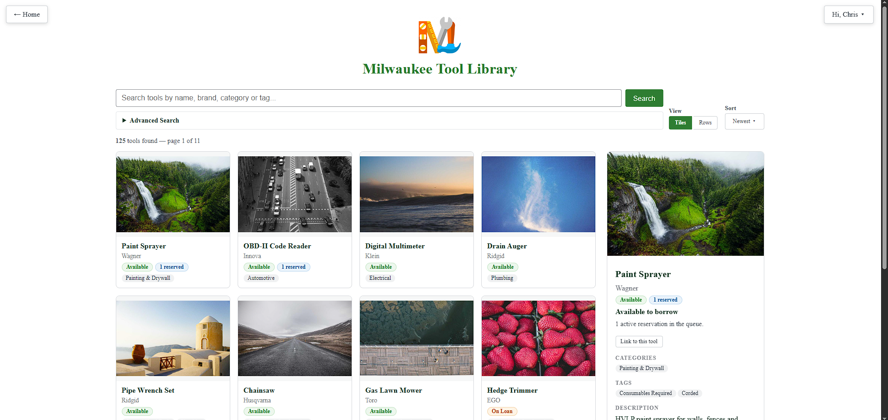

# My Tool Library

Run a community tool-lending library from WordPress: inventory, memberships, reservations, and loans, with a zero-JavaScript public catalog.

Built by the [Milwaukee Tool Library](https://mkelibrary.org) (Evan Maruszewski & Chris McHenry).

## What it does

**For your community**
- Browse and search/filter the tool catalog (no account required)
- Create a free account, reserve a tool, and track queue position
- View active loans and due dates (due soon, due today, overdue)
- Works with **zero JavaScript** on every public-facing page

**For your staff**
- Configurable Dashboard of stat panels (membership, loans, overdue, popularity, asset value)
- Inventory management with CSV bulk import and per-tool financial tracking
- Membership management with CSV bulk import and identity-verification tracking
- Unified Loans & Reservations page: check out, cancel, renew, end
- Setup page for branding, categories/tags, database install, and full data export

## Requirements

- WordPress 5.8+
- PHP 7.4+

## Installation

1. Upload the plugin to `/wp-content/plugins/my-tool-library`, or install via the Plugins screen.
2. Activate the plugin.
3. Go to **My Tool Library > Setup** and click **Run Database Setup**.
4. Confirm your site's timezone under **Settings > General > Timezone**.
5. Fill in branding and pickup/verification directions on the Setup page.
6. Add the **Public Page Link** to your site's navigation.
7. Add categories/tags, tools, and members (one at a time or via CSV import).

Full installation steps, FAQ, and changelog: [`my-tool-library/readme.txt`](my-tool-library/readme.txt).

## Scope and assumptions

This plugin is built around a specific, deliberately simple operating model: single location/single copy per tool, staff-run (not enforced) identity verification, trusted WordPress Administrators as staff, no payment processing, and no outbound email notifications. See the ["Assumptions and intended use"](my-tool-library/readme.txt) section of the full readme before installing.

## Documentation

- [`my-tool-library/readme.txt`](my-tool-library/readme.txt) — full WordPress.org-style readme (Description, Installation, FAQ, Screenshots, Changelog)
- [`my-tool-library/documentation/staff-workflows.md`](my-tool-library/documentation/staff-workflows.md) — staff workflow guide
- [`my-tool-library/documentation/mtl_database_schematic/schema.dbml`](my-tool-library/documentation/mtl_database_schematic/schema.dbml) — database schema
- [`my-tool-library/documentation/dummy-data.sql`](my-tool-library/documentation/dummy-data.sql) — sample data for local testing

## License

GPLv2 or later. See [LICENSE](LICENSE).
