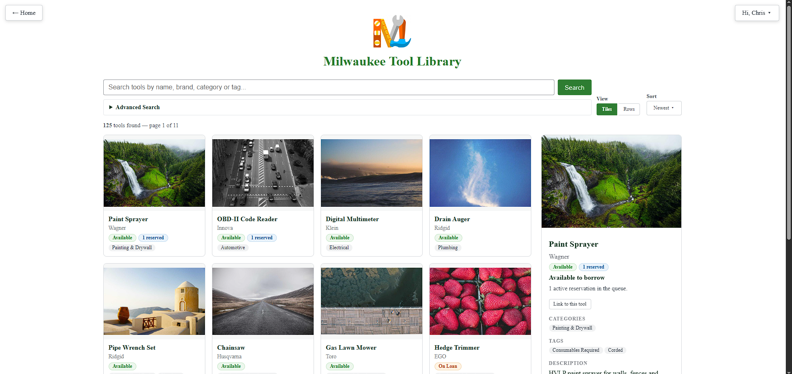
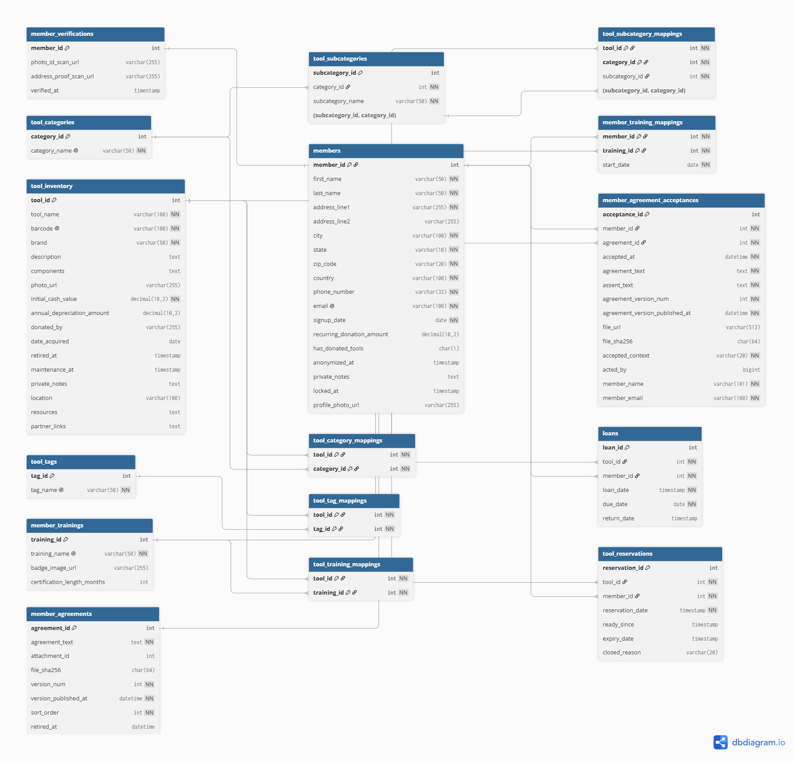

# My Tool Library

Run a community tool-lending library from WordPress: inventory, memberships, reservations, and loans, with a zero-JavaScript public catalog.

Built by the [Milwaukee Tool Library](https://mkelibrary.org) (Evan Maruszewski & Chris McHenry).

## What it does

**For your community**

- Browse and search the catalog without an account
- Sign up free, reserve tools, and see your place in each queue
- See loans flagged due soon, due today or overdue, plus your loan history
- Update your details, see your trainings, or delete your account
- Agree to member agreements online, if the library uses them
- No JavaScript on any public page

**For your staff**

- **Dashboard:** drag, resize and hide stat panels (membership, loans, overdue, popularity, donors, asset value)
- **Inventory:** CSV import, sub-categories, shelf locations, resource and partner links, value and depreciation
- **Maintenance and Retire:** take a tool out of service for a while, or for good
- **Membership:** CSV import, ID verification, profile photos, private notes, setup-link emails
- **Account locks:** stop a member reserving or borrowing until unlocked
- **Trainings:** expiring certifications; tools can require them
- **Member agreements:** online, or recorded from signed paper copies
- **Loans & Reservations:** check out, renew, return and cancel in one place, including bulk checkout by barcode
- **Reservations** expire on their own after a hold period you set
- **Workflows:** a staff guide inside the admin
- **Setup:** branding, categories/tags/trainings, and defaults
- **Backup and restore:** download the whole library as one `.sql` file, schedule encrypted automatic backups to the Media Library (administrators only), and restore either from Setup after a mistake or a lost database

## Requirements

- WordPress 5.8+
- PHP 7.4+

## Installation

1. Upload the plugin folder (`my-tool-library`) to `/wp-content/plugins/`, or install via the Plugins screen (only the `my-tool-library` folder is required).
2. Activate the plugin.
3. Go to **My Tool Library > Setup** and click **Run Database Setup**.
4. Confirm your site's timezone under **Settings > General > Timezone**.
5. Fill in branding and pickup/verification directions on the Setup page.
6. Add the **Public Page Link** to your site's navigation.
7. Add categories/tags, tools, and members (one at a time or via CSV import).

Full installation steps, FAQ, and changelog: [`my-tool-library/readme.txt`](my-tool-library/readme.txt).

## Scope and assumptions

This plugin is built around a specific, deliberately simple operating model: single location/single copy per tool, staff-run (not enforced) identity verification, WordPress Editors and Administrators as staff, no payment processing, and no status notifications (account, password and member-agreement email only). See the ["Assumptions and intended use"](my-tool-library/readme.txt) section of the full readme before installing.

## Documentation

- [`my-tool-library/readme.txt`](my-tool-library/readme.txt) — full WordPress.org-style readme (Description, Installation, FAQ, Screenshots, Changelog)
- [`my-tool-library/documentation/staff-workflows.md`](my-tool-library/documentation/staff-workflows.md) — staff workflow guide
- [`my-tool-library/documentation/schema.dbml`](my-tool-library/documentation/schema.dbml) — database schema
- [`my-tool-library/documentation/dummy-data.sql`](my-tool-library/documentation/dummy-data.sql) — sample data for local testing
- Database Schema
  

## License

GPLv2 or later. See [LICENSE](LICENSE).
